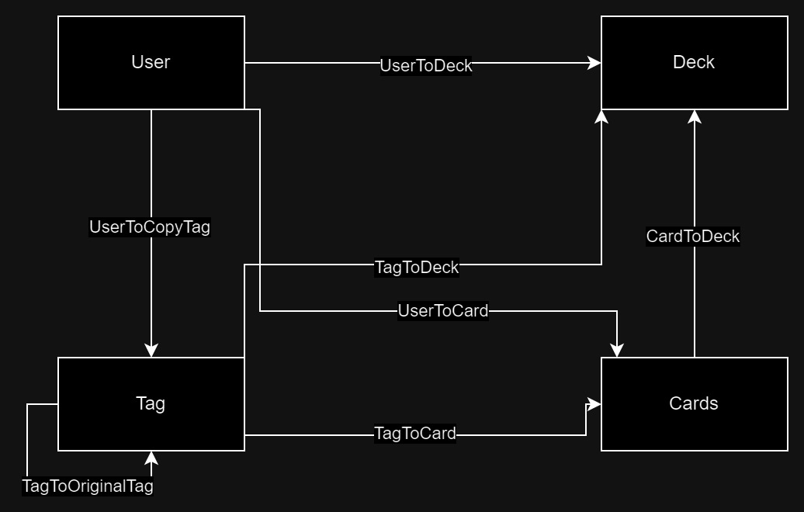

## Document Collections

### User

-   Stores user information
-   Only an username and password are required to create an account
-   The username is unique
-   The password is hashed with bcrypt

#### TODO

-   Add a profile picture
-   Add a description
-   Add a list of friends

### Cards

-   Stores card information
-   We use the scryfall API to get the card information
-   We store the scryfall ID as the key of the document

### Decks

-   Stores deck information

### Tags

-   Stores tag information
-   Whenever a user wants to add an existing tag to a card/deck, we will duplicate the tag in the collection
-   Then an edge will be created between:
    -   The new tag and the original tag
    -   The new tag and the card/deck
    -   The user and the new tag
    -   This way we can keep track of user -> tag -> card. The decks are not a problem since they are created by the users, but the cards are not and we need to keep track of who added the tag to the card as this are personal tags.

## Edge Collections

### User -> Card

-   Stores information between a user and a card
-   It is used to keep track of:
    -   If a user owns a card
    -   The ratings that a user has given to a card
    -   Comments that a user has made on a card

### User -> Deck

-   Stores information between a user and a deck
-   It is used to keep track of:
    -   If a user owns a deck
    -   The ratings that a user has given to a deck
    -   Comments that a user has made on a deck

### User -> CopyTag

-   Whenever a user wants to add an existing tag to a card/deck, we will duplicate the tag in the collection
-   Then an edge will be created between:
    -   The new tag and the original tag
    -   The new tag and the card/deck
    -   The user and the new tag
    -   This way we can keep track of user -> tag -> card. The decks are not a problem since they are created by the users, but the cards are not and we need to keep track of who added the tag to the card as this are personal tags.
-   Whenever a user wants to create a new tag, we will create it in the collection with a private flag set to true so that only the user can see it
